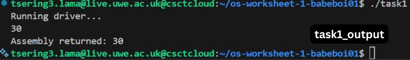
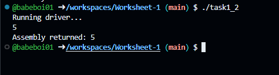
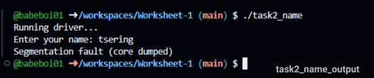
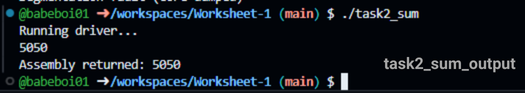
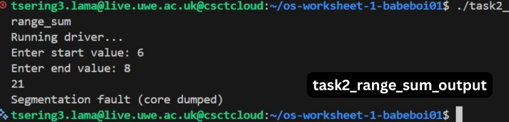

# 📘 Worksheet 1 — Assembly Programming (NASM + GCC)

## 📝 Overview
This worksheet covers the basics of **x86 Assembly Programming** using the **NASM assembler**, a **C driver**, and the **ASM I/O library**. You will learn:

- Printing strings and integers
- Taking user input (string & integer)
- Performing arithmetic
- Using loops and conditions
- Integrating assembly with a C program
- Building using a Makefile

All tasks and **full source code** are included below.

---

## 🚀 How to Build
Run:
```
make
```
This creates:
```
task1
task1_2
task2_name
task2_sum
task2_range_sum
```
Run any program:
```
./task1
./task2_sum
```

---

## 📁 Project Structure
```
Worksheet-1/
│
├── src/
│   ├── task1.asm
│   ├── task1_2.asm
│   ├── task2_name.asm
│   ├── task2_sum.asm
│   ├── task2_range_sum.asm
│   ├── asm_io.inc
│   └── driver.c
│
├── asm_io.o
├── Makefile
└── README.md
```

---

## 🛠 Makefile
```
ASM = nasm
CC = gcc

ASFLAGS = -f elf32 -Isrc
CFLAGS  = -m32 -c

all: task1 task1_2 task2_name task2_sum task2_range_sum

task1: src/driver.o src/task1.o src/asm_io.o
	$(CC) -m32 src/driver.o src/task1.o src/asm_io.o -o task1

task1_2: src/driver.o src/task1_2.o src/asm_io.o
	$(CC) -m32 src/driver.o src/task1_2.o src/asm_io.o -o task1_2

task2_name: src/driver.o src/task2_name.o src/asm_io.o
	$(CC) -m32 src/driver.o src/task2_name.o src/asm_io.o -o task2_name

task2_sum: src/driver.o src/task2_sum.o src/asm_io.o
	$(CC) -m32 src/driver.o src/task2_sum.o src/asm_io.o -o task2_sum

task2_range_sum: src/driver.o src/task2_range_sum.o src/asm_io.o
	$(CC) -m32 src/driver.o src/task2_range_sum.o src/asm_io.o -o task2_range_sum

src/driver.o: src/driver.c
	$(CC) $(CFLAGS) src/driver.c -o src/driver.o

src/%.o: src/%.asm
	$(ASM) $(ASFLAGS) $< -o $@

clean:
	rm -f src/*.o task1 task1_2 task2_name task2_sum task2_range_sum
```

---

## 🧩 asm_io.inc
```
extern print_int
extern print_string
extern print_nl
extern read_int
extern read_string
```

---

## 🧩 driver.c
```
#include <stdio.h>

void asm_main();

int main() {
    asm_main();
    return 0;
}
```

---

# 🧪 TASK 1 — Print a Message
### Description:
Print a simple message using NASM.

### task1.asm
```
%include "asm_io.inc"

section .data
msg db "Hello from Assembly!", 0

section .text
global asm_main

asm_main:
    mov eax, msg
    call print_string
    call print_nl
    ret

```
output


---

# 🧪 TASK 1.2 — Print Two Messages
### Description:
Display two separate messages.

### task1_2.asm
```
%include "asm_io.inc"

section .data
msg1 db "This is message 1", 0
msg2 db "This is message 2", 0

section .text
global asm_main

asm_main:
    mov eax, msg1
    call print_string
    call print_nl

    mov eax, msg2
    call print_string
    call print_nl
    ret

```
output


---

# 🧪 TASK 2 — Input User Name
### Description:
Read a name from the user and print a greeting.

### task2_name.asm
```
%include "asm_io.inc"

section .data
prompt db "Enter your name: ", 0
outmsg db "Hello, ", 0
buffer times 64 db 0

section .text
global asm_main

asm_main:
    mov eax, prompt
    call print_string

    mov eax, buffer
    call read_string

    mov eax, outmsg
    call print_string

    mov eax, buffer
    call print_string
    call print_nl
    ret
```
output


---

# 🧪 TASK 2 — Sum of Two Integers
### Description:
Take two integers as input and print their sum.

### task2_sum.asm
```
%include "asm_io.inc"

section .data
p1 db "Enter first number: ", 0
p2 db "Enter second number: ", 0
res db "Sum = ", 0

section .text
global asm_main

asm_main:
    mov eax, p1
    call print_string
    call read_int
    mov ebx, eax

    mov eax, p2
    call print_string
    call read_int
    add eax, ebx

    mov ebx, eax

    mov eax, res
    call print_string

    mov eax, ebx
    call print_int
    call print_nl
    ret
```
output


---

# 🧪 TASK 2 — Range Sum
### Description:
Input a start and end value, sum all numbers in the range, and print the result.

### task2_range_sum.asm
```
%include "asm_io.inc"

section .data
startmsg db "Enter start: ", 0
endmsg   db "Enter end: ", 0
outmsg   db "Total sum = ", 0

section .text
global asm_main

asm_main:
    mov eax, startmsg
    call print_string
    call read_int
    mov ebx, eax

    mov eax, endmsg
    call print_string
    call read_int
    mov ecx, eax

    xor edx, edx

.loop:
    cmp ebx, ecx
    >
    add edx, ebx
    inc ebx
    jmp .loop

.done:
    mov eax, outmsg
    call print_string

    mov eax, edx
    call print_int
    call print_nl
    ret
```
output


---

# 🎉 Worksheet 1 Completed
This README contains:

- All task descriptions
- All assembly code
- Full Makefile
- driver.c
- asm_io.inc
- Build + run instructions


